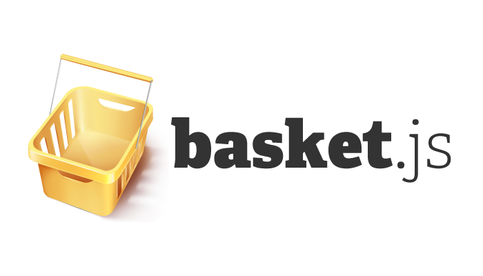

[](http://addyosmani.github.io/basket.js/)

> [Basket.js](http://addyosmani.github.io/basket.js/) is a script and resource loader for caching and loading scripts using localStorage


##Introduction for the Non-Developer

Modern web applications will typically make use of more than one JavaScript or CSS framework. As the number of scripts add up, so does the number of HTTP requests. This leads to increased page load times and reduced performance. [Basket.js](http://addyosmani.github.io/basket.js/) is a project dedicated to aleviating this problem. 

Basket.js loads your site's scripts into a page and saves them in localStorage so they can be reused after the session until they are expired. It also checks to see if the scripts are already in localStorage, and if not, loads them. This prevents unneccessary reloading of scripts and can improve load time and website performance.


[](https://travis-ci.org/addyosmani/basket.js)


## Resources

### Examples

* [Load RequireJS modules with Basket.js](https://github.com/andrewwakeling/requirejs-basketjs/blob/master/basket-loader.js)
* [Loading CSS with Basket.js](https://github.com/andrewwakeling/basket-css-example)

### Articles

* [Basket.js: A JavaScript Loader With LocalStorage-based script caching](http://badassjs.com/post/40850339601/basket-js-a-javascript-loader-with-localstorage-based)
* [basket.js caches scripts with HTML5 localStorage](http://ahmadassaf.com/blog/web-development/scripts-plugins/basket-js-caches-scripts-with-html5-localstorage/)
* [Basket.js for improved script caching](http://t3n.de/news/basketjs-performance-localstorage-515119/)
* [How to Improve Loading Time with basket.js](http://www.sitepoint.com/how-to-improve-loading-time-with-basket-js/)


## Contribute

### Style Guide

This project follows the [Idiomatic](https://github.com/rwaldron/idiomatic.js) guide to writing JavaScript - a concise extension to the jQuery Core Style [guidelines](http://contribute.jquery.org/style-guide/js/), with the exception of multiple var statements. Please ensure any pull requests follow these closely.


### Unit Tests

We are also attempting to get as much unit test coverage as possible. For this reason, please add unit tests for any new or changed functionality and remember to lint and test your code using [grunt](http://gruntjs.com).

*Also, please don't edit files in the "dist" subdirectory as they are generated via grunt. You'll find source code in the "lib" subdirectory!*

### Building

To build the project, you will first need to install the necessary dependencies (such as [RSVP](https://github.com/tildeio/rsvp.js)) using [npm](https://www.npmjs.com/) and [Bower](http://bower.io).

Run:

```sh
$ npm install & bower install
```

in the project root to get everything you need. Next, to actually build the project you will need [Grunt](http://gruntjs.com).

Run:

```sh
$ grunt release
```

to generate a new release, otherwise just running `grunt test` will run the unit tests.


## Team

|  |  |  |  |
|---|---|---|---|
| [Addy Osmani](https://github.com/addyosmani) | [Sindre Sorhus](https://github.com/sindresorhus) | [Andrée Hansson](https://github.com/peol) | [Mat Scales](https://github.com/wibblymat) |


## License

MIT © Basket.js team
